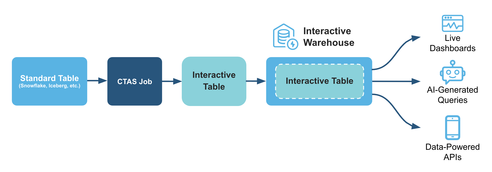
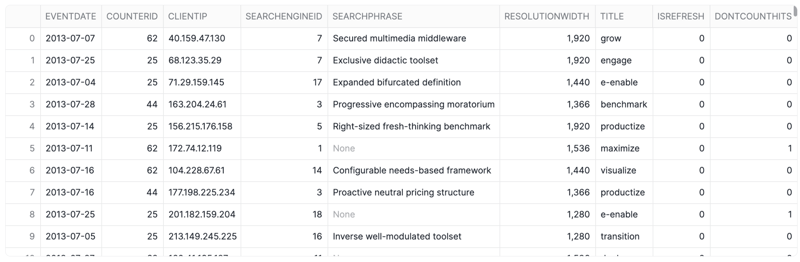
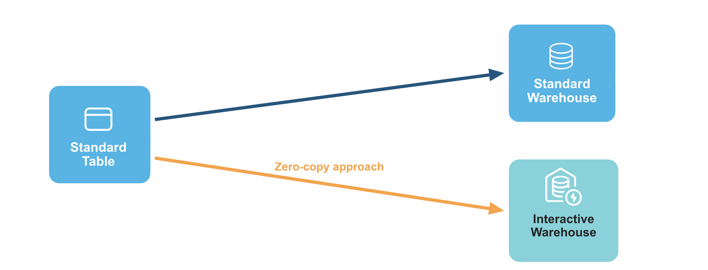
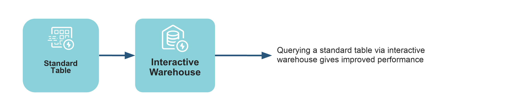
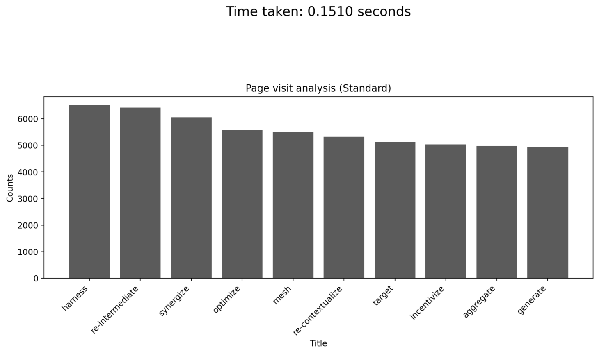
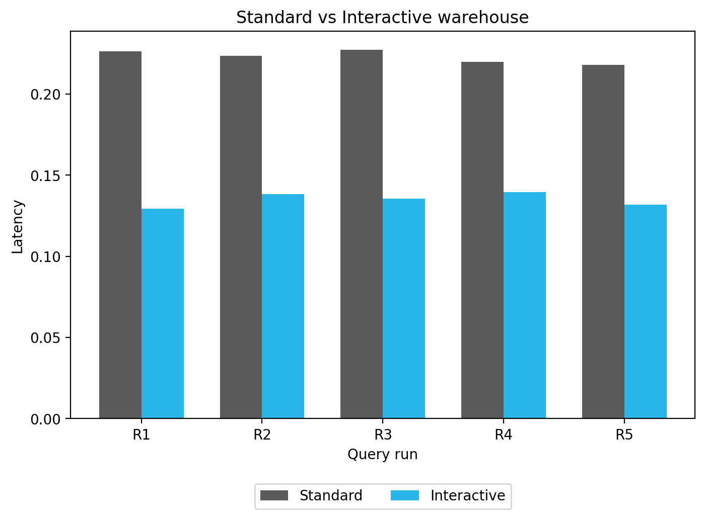

author: Chanin Nantasenamat
id: getting-started-with-interactive-analytics
summary: This guide demonstrates how to set up and use Snowflake's Interactive Analytics to achieve sub-second query performance.
categories: snowflake-site:taxonomy/solution-center/certification/quickstart, snowflake-site:taxonomy/product/analytics, snowflake-site:taxonomy/snowflake-feature/interactive-tables, snowflake-site:taxonomy/snowflake-feature/interactive-warehouse
language: en
environments: web
status: Published

# Getting Started with Snowflake Interactive Analytics

## Overview

When it comes to near real-time (or sub-second) analytics, the ideal scenario involves achieving consistent, rapid query performance and managing costs effectively, even with large datasets and high user demand. 

Snowflake's new Interactive Warehouses and Tables are designed to deliver on these needs. They provide high-concurrency, low-latency serving layer for near real-time analytics. This allows consistent, sub-second query performance for live dashboards and APIs with great price-for-performance. With this end-to-end solution, you can avoid operational complexities and tool sprawl.

Here's how interactive warehouses and tables fits in for a typical data analytics pipeline:



### What You'll Learn
- The core concepts behind Snowflake's Interactive Warehouses and Tables and how they provide low-latency analytics.
- How to create and configure an Interactive Warehouse using SQL.
- The process of creating an Interactive Table from an existing standard table.
- How to attach a table to an Interactive Warehouse to pre-warm the data cache for faster queries.
- A methodology for benchmarking and comparing the query latency of an interactive setup versus a standard warehouse.
- How zero-copy interactive analytics extends an interactive warehouse to query standard tables, Iceberg tables, and dynamic tables directly, with no conversion required.

### What You'll Build

You will build a complete, functioning interactive data environment in Snowflake, including a dedicated Interactive Warehouse and an Interactive Table populated with data. You will also create a Python-based performance test that executes queries against both your new interactive setup and a standard configuration, culminating in a comparative bar chart that visually proves the latency improvements.

### Prerequisites
- Access to a [Snowflake account](https://signup.snowflake.com/?utm_source=snowflake-devrel&utm_medium=developer-guides&utm_cta=developer-guides)
- Basic knowledge of SQL and Python.
- Familiarity with data warehousing and performance concepts.
- A Snowflake role with privileges to create warehouses and tables (*i.e.*, `ACCOUNTADMIN` is used in the notebook).

## Understand Interactive Warehouses and Interactive Tables

To boost query performance for interactive, sub-second analytics, Snowflake introduces two new, specialized objects that work together: interactive warehouses and interactive tables.

Think of them as a high-performance pair. Interactive tables are structured for extremely fast data retrieval, and interactive warehouses are the specialized engines required to query them. Using them in tandem is the key to achieving the best possible query performance and lowest latency.


### Interactive Warehouses
An interactive warehouse tunes the Snowflake engine specially for low-latency, interactive workloads. This type of warehouse is optimized to run continuously, serving high volumes of concurrent queries. All interactive warehouses run on the latest generation of hardware. Interactive warehouses can query interactive tables natively. With zero-copy interactive analytics, they can also query standard tables, Iceberg tables, and dynamic tables directly, with no conversion required.

### Interactive Tables
Interactive tables have different methods for data ingestion and support a more limited set of SQL statements and query operators than standard Snowflake tables.

### Zero-Copy Interactive Analytics

> Note: Querying standard tables, Iceberg tables, and dynamic tables through an interactive warehouse is currently in Public Preview.

If you are already using interactive tables with an interactive warehouse, zero-copy interactive analytics extends that setup to other table types without requiring any conversion. An interactive warehouse can query the following table types directly:

- **Standard tables.** Your existing Snowflake tables are queryable with no `CREATE INTERACTIVE TABLE` step.
- **Iceberg tables.** Open-format Iceberg data served at interactive latency.
- **Dynamic tables.** Incrementally refreshed results that an interactive warehouse can query directly.

The setup is straightforward. Create an interactive warehouse, optionally attach your highest-priority tables for proactive cache warming, then query any standard table directly:

```sql
-- 1. Create an interactive warehouse
CREATE OR REPLACE INTERACTIVE WAREHOUSE analytics_iwh
  WAREHOUSE_SIZE = 'XSMALL';

-- 2. (Optional) Attach high-priority tables for proactive caching
ALTER WAREHOUSE analytics_iwh
  ADD TABLES (your_db.your_schema.critical_table_1, your_db.your_schema.critical_table_2);

-- 3. Query any standard table, no conversion needed
USE WAREHOUSE analytics_iwh;
SELECT * FROM your_db.your_schema.any_standard_table WHERE ...;
```

With this expansion, `ADD TABLES` shifts from a prerequisite to a performance optimization: attaching a table proactively warms the cache, but unattached tables are still fully queryable and cached on demand when first accessed.

> Note: This guide's hands-on demo follows the classic pattern of creating an interactive table and querying it on an interactive warehouse, which delivers the strictest tail-latency guarantees. Zero-copy means the same interactive warehouse can also query your standard, Iceberg, and dynamic tables directly.

### Use cases
Interactive warehouses and interactive tables are built for one specific shape of work: simple, repetitive queries that must return in well under a second, run at high concurrency, against fresh data, and at a low cost per query. These aren't the complex, long-running transformations you'd send to a standard warehouse. Instead, they're the same handful of query patterns executed over and over, by thousands of users and, increasingly, by AI agents. Wherever that pattern shows up, this pairing is a strong fit.


Three domains capture where it matters most:

- **AI & Agents.** Agentic and AI-driven applications fire off large volumes of small, concurrent queries, such as a retrieval step here or a metric lookup there, and each one needs to come back instantly and cheaply. Interactive warehouses make this practical for low-cost RAG retrieval, AI observability (monitoring model and agent behavior in near real time), and high-concurrency MCP servers that expose your data to many agents at once.
- **Customer-Facing Data Apps.** When query latency is visible to your end users, consistency matters as much as raw speed. This pairing powers data APIs that serve predictable, sub-second responses to customer-facing applications, embedded analytics inside your product, and live dashboards that stay responsive even under heavy, simultaneous use.
- **Operational Analytics.** Internal, decision-driving workloads depend on fresh data and fast answers. Interactive warehouses and tables suit trading and risk management, infrastructure observability and alerting (high-throughput monitoring where every second counts), and supply chain and inventory tracking that must reflect the latest state of the business.

What unites all of these is the same set of requirements, namely low latency, high concurrency, fresh data, and low cost per query, met by simple queries repeated at scale. That is exactly the workload interactive warehouses and tables were designed for.


### Limitations

The queries that work best with interactive tables are usually `SELECT` statements with selective `WHERE` clauses, optionally including a `GROUP BY` clause on a few dimensions.

Here are some limitations of interactive warehouses and interactive tables:
- An interactive warehouse is designed to stay up and running. It supports auto-suspend and auto-resume, but the minimum auto-suspend interval is 24 hours (86400 seconds), so it suspends only after 24 hours of inactivity. You can also suspend and resume it manually. Either way, expect significant query latency right after a resume, while the data cache warms up again.
- Interactive warehouses cancel any query that runs longer than 5 seconds, since they're tuned for short, low-latency queries. To protect p99 latency, configure a fallback warehouse so those queries are transparently re-run on a standard warehouse (see the "Configure a fallback warehouse" section below). Interactive tables also don't support ETL or data manipulation language (DML) commands such as `UPDATE` and `DELETE`.
- To modify data, update the base (source) table and either fully replace the interactive table with a new version or use a dynamic-table-style incremental refresh (set `TARGET_LAG`).
- You can't run `CALL` commands to call stored procedures through interactive warehouse

<!-- ------------------------ -->
## Setup

### Data operations

> Note: The companion notebook creates all of these objects automatically using the `{{DB_NAME}}` and `{{STANDARD_WH_NAME}}` variables defined in the "Set common variables" cell. The steps below show the equivalent manual SQL. If running outside the notebook, replace `{{DB_NAME}}` and `{{STANDARD_WH_NAME}}` with your own names (e.g. `JSMITH_MY_DEMO_DB` and `JSMITH_STD_WH`).

#### Optional: Create warehouse

In order to create an interactive table and fill the table with data, you'll need to use a standard warehouse.
You can use any existing warehouse or create a new one, here we'll create a new warehouse called `{{STANDARD_WH_NAME}}`:

```sql
CREATE OR REPLACE WAREHOUSE {{STANDARD_WH_NAME}} WITH WAREHOUSE_SIZE='X-SMALL';
```

#### Step 1: Create a Database and Schema

First, we'll start by creating a database called `{{DB_NAME}}` and `BENCHMARK_FDN` and `BENCHMARK_INTERACTIVE` as schemas:

```sql
CREATE DATABASE IF NOT EXISTS {{DB_NAME}};
CREATE SCHEMA IF NOT EXISTS {{DB_NAME}}.BENCHMARK_FDN;
CREATE SCHEMA IF NOT EXISTS {{DB_NAME}}.BENCHMARK_INTERACTIVE;
```

#### Step 2: Create a new stage
Next, we'll create a stage called `my_csv_stage` where the CSV file will soon be stored:

```sql
-- Define database and schema to use
USE SCHEMA {{DB_NAME}}.BENCHMARK_FDN;

-- Create a stage that includes the definition for the CSV file format
CREATE OR REPLACE STAGE my_csv_stage
  FILE_FORMAT = (
    TYPE = 'CSV'
    SKIP_HEADER = 1
    FIELD_OPTIONALLY_ENCLOSED_BY = '"'
  );
```

#### Step 3: Upload CSV to a stage

1. In the Snowflake UI, navigate to the database/schema that you've created (`{{DB_NAME}}.BENCHMARK_FDN`).
2. Go to the `my_csv_stage` stage
3. Upload the [`synthetic_hits_data.csv`](https://github.com/Snowflake-Labs/snowflake-demo-notebooks/blob/main/Interactive_Analytics/synthetic_hits_data.csv) file to this stage.

#### Step 4: Create the Table and Load Data

Now that we have the CSV file in the stage, we'll need to create the `HITS2_CSV` table and extract contents from the CSV file into it.

```sql
-- Use your database and schema
USE SCHEMA {{DB_NAME}}.BENCHMARK_FDN;

-- Create the table with the correct data types
CREATE OR REPLACE TABLE HITS2_CSV (
    EventDate DATE,
    CounterID INT,
    ClientIP STRING,
    SearchEngineID INT,
    SearchPhrase STRING,
    ResolutionWidth INT,
    Title STRING,
    IsRefresh INT,
    DontCountHits INT
);

-- Copy the data from your stage into the table
-- Make sure to replace 'my_csv_stage' with your stage name
COPY INTO HITS2_CSV FROM @my_csv_stage/synthetic_hits_data.csv
  FILE_FORMAT = (TYPE = 'CSV' SKIP_HEADER = 1);
```

#### Step 5: Query the data

Finally, we'll now retrieve contents from the table by performing a simple query with the `SELECT` statement:

```sql
USE WAREHOUSE {{STANDARD_WH_NAME}};
SELECT * FROM {{DB_NAME}}.BENCHMARK_FDN.HITS2_CSV;
```

This essentially retrieves data from the `{{DB_NAME}}` database, `BENCHMARK_FDN` schema and `HITS2_CSV` table:



<!-- ------------------------ -->
## Performance Demo of Snowflake's Interactive Warehouses/Tables

To proceed with carrying out this performance comparison of interactive warehouses/tables with standard ones, you can download notebook file [Getting_Started_with_Interactive_Analytics.ipynb](https://github.com/Snowflake-Labs/snowflake-demo-notebooks/blob/main/Interactive_Analytics/Getting_Started_with_Interactive_Analytics.ipynb) provided in the repo.

### Set common variables

First, we'll derive session-scoped variable names from your Snowflake username. This ensures database and warehouse names are unique per user and avoids conflicts when multiple users run the notebook on the same account:

```python
from snowflake.snowpark.context import get_active_session

session = get_active_session()
USER = session.sql("SELECT CURRENT_USER()").collect()[0][0]
DB_NAME = f'{USER}_MY_DEMO_DB'
INTERACTIVE_WH_NAME = f'{USER}_INT_WH'
STANDARD_WH_NAME = f'{USER}_STD_WH'

print(f"User: {USER}\nDatabase: {DB_NAME}\nInteractive WH: {INTERACTIVE_WH_NAME}\nStandard WH: {STANDARD_WH_NAME}")
```

### Set up role, warehouse, and database

Interactive Warehouses and Interactive Tables are now generally available (GA) and enabled by default on your account, so there's no need to check the Snowflake version or verify any account parameters.

The following SQL cell creates the standard warehouse, database, and schemas used throughout the notebook. All statements use `IF NOT EXISTS`, so this cell is safe to re-run:

```sql
USE ROLE ACCOUNTADMIN;

-- Create the compute and database objects used throughout this notebook (idempotent)
CREATE WAREHOUSE IF NOT EXISTS {{STANDARD_WH_NAME}} WITH WAREHOUSE_SIZE = 'X-SMALL';
CREATE DATABASE IF NOT EXISTS {{DB_NAME}};

CREATE SCHEMA IF NOT EXISTS {{DB_NAME}}.BENCHMARK_FDN;
CREATE SCHEMA IF NOT EXISTS {{DB_NAME}}.BENCHMARK_INTERACTIVE;

USE WAREHOUSE {{STANDARD_WH_NAME}};
USE DATABASE {{DB_NAME}};
```

> Note: In a Snowflake Notebook, SQL and Python cells share the same session. Any `USE ROLE`, `USE DATABASE`, or `USE WAREHOUSE` statement you run in a SQL cell also applies to subsequent Python cells (and vice versa).

### Create an interactive warehouse


Next, let's create our interactive warehouse using a SQL cell:

```sql
CREATE OR REPLACE INTERACTIVE WAREHOUSE {{INTERACTIVE_WH_NAME}}
    WAREHOUSE_SIZE = 'XSMALL'
    MIN_CLUSTER_COUNT = 1
    MAX_CLUSTER_COUNT = 1
    COMMENT = 'Interactive warehouse demo';
```

### Data setup and loading

Before loading data, ensure the standard warehouse is active:

```sql
USE WAREHOUSE {{STANDARD_WH_NAME}};
```

The following Python cell creates the `HITS2_CSV` table and loads it from the `synthetic_hits_data.csv` file bundled with the notebook. The load is idempotent: it checks whether the table already contains rows and, if so, skips the load on subsequent runs.

> Note: The data is loaded from the bundled CSV using `pandas` and `write_pandas` with no external network access required. Make sure `synthetic_hits_data.csv` is added to the notebook's files.

```python
import pandas as pd

DB, SCHEMA, TABLE = DB_NAME, "BENCHMARK_FDN", "HITS2_CSV"
FQ = f"{DB}.{SCHEMA}.{TABLE}"
CSV_FILE = "synthetic_hits_data.csv"  # bundled with this notebook

# Create the source table if it doesn't already exist
session.sql(f"""
CREATE TABLE IF NOT EXISTS {FQ} (
    EventDate DATE,
    CounterID INT,
    ClientIP STRING,
    SearchEngineID INT,
    SearchPhrase STRING,
    ResolutionWidth INT,
    Title STRING,
    IsRefresh INT,
    DontCountHits INT
)
""").collect()

# Idempotent load: only load when the table is empty
row_count = session.sql(f"SELECT COUNT(*) FROM {FQ}").collect()[0][0]
if row_count > 0:
    print(f"{FQ} already has {row_count:,} rows. Skipping data load.")
else:
    print(f"Loading data into {FQ} ...")
    pdf = pd.read_csv(CSV_FILE)
    pdf["EventDate"] = pd.to_datetime(pdf["EventDate"]).dt.date    
    session.write_pandas(pdf, TABLE, database=DB, schema=SCHEMA, quote_identifiers=False)
    row_count = session.sql(f"SELECT COUNT(*) FROM {FQ}").collect()[0][0]
    print(f"Loaded {row_count:,} rows into {FQ}.")
```

We can then verify the loaded data with a quick query:

```sql
USE WAREHOUSE {{STANDARD_WH_NAME}};
SELECT * FROM {{DB_NAME}}.BENCHMARK_FDN.HITS2_CSV;
```

This essentially retrieves data from the database, `BENCHMARK_FDN` schema and `HITS2_CSV` table:


### Create an interactive table


Now, we'll use the standard warehouse to efficiently create our new interactive `CUSTOMERS` table by copying all the data from the original standard table:

```sql
-- Use a standard warehouse to build the interactive table's data
USE WAREHOUSE {{STANDARD_WH_NAME}};
CREATE SCHEMA IF NOT EXISTS {{DB_NAME}}.BENCHMARK_INTERACTIVE;

CREATE OR REPLACE INTERACTIVE TABLE
  {{DB_NAME}}.BENCHMARK_INTERACTIVE.CUSTOMERS CLUSTER BY (ClientIP)
AS
  SELECT * FROM {{DB_NAME}}.BENCHMARK_FDN.HITS2_CSV;
```

### Attach interactive table to a warehouse



Next, we'll attach our interactive table to the warehouse, which pre-warms the data cache for optimal query performance:

```sql
USE DATABASE {{DB_NAME}};
ALTER WAREHOUSE {{INTERACTIVE_WH_NAME}} ADD TABLES(BENCHMARK_INTERACTIVE.CUSTOMERS);
```

> Note: `ADD TABLES` is a performance optimization, not a requirement. It proactively warms the warehouse's data cache so queries avoid a cold start. Any table you don't attach is still queryable and gets cached on demand the first time it's accessed. Proactive warming is currently limited to 10 tables.

### Configure a fallback warehouse

Interactive warehouses are tuned for short, sub-second queries, so Snowflake fixes their statement timeout at a maximum of 5 seconds and automatically cancels any query that runs longer. To make sure an occasional heavy or ad-hoc query still completes instead of failing, you can designate a **fallback warehouse**: a standard warehouse that automatically re-runs any query that exceeds the 5-second timeout on the interactive warehouse.

This retry is transparent to the client (it behaves as an internal retry), so the query still returns its result. It keeps fast dashboard queries responsive while isolating them from the occasional long-running query.

We'll reuse the standard warehouse created earlier as the fallback, then confirm the setting via the `FALLBACK_WAREHOUSE` column:

```sql
ALTER WAREHOUSE {{INTERACTIVE_WH_NAME}} SET FALLBACK_WAREHOUSE = {{STANDARD_WH_NAME}};

SHOW WAREHOUSES LIKE '{{INTERACTIVE_WH_NAME}}';
```

A few things to keep in mind about fallback warehouses:
- The fallback is a **standard** warehouse and can be shared with non-interactive workloads. Choose a size that's the same as or larger than the interactive warehouse.
- It must be started (or set to auto-resume) to accept retried queries, and standard credit consumption applies once it's active.
- The querying role needs `USAGE` on both the interactive warehouse and its fallback warehouse. Setting a fallback requires `ALTER WAREHOUSE` on the interactive warehouse and `USAGE` on the fallback.
- When a retry occurs, the time spent on the interactive warehouse before the retry appears as `fault_handling_time` in the query profile.
- To remove the fallback warehouse later, run `ALTER WAREHOUSE {{INTERACTIVE_WH_NAME}} UNSET FALLBACK_WAREHOUSE;`.

### Run queries with interactive warehouse



Now, we'll run our first performance test on the interactive setup by executing a page-view query, timing its execution, and then plotting the results.

We'll start by activating the interactive warehouse and disabling the result cache using a SQL cell:

```sql
USE WAREHOUSE {{INTERACTIVE_WH_NAME}};
USE DATABASE {{DB_NAME}};
ALTER SESSION SET USE_CACHED_RESULT = FALSE;
```


Before running the timed query, we define a helper function for visualization:

```python
import matplotlib.pyplot as plt

def plot_data(data, title, time_taken, color='#29B5E8'):
    titles = [item[0] for item in data]
    counts = [item[1] for item in data]

    plt.figure(figsize=(12, 4))
    plt.bar(titles, counts, color=color)
    plt.xticks(rotation=45, ha='right')
    plt.ylabel("Counts")
    plt.xlabel("Title")
    plt.title(title)
    plt.text(0.5, 1.5, f'Time taken: {time_taken:.4f} seconds',
         ha='center', va='top',
         transform=plt.gca().transAxes,
         fontdict={'size': 16})
    plt.show()
```

Next, in a Python cell we'll run a query to find the top 10 most viewed pages for July 2013, measure how long it takes, and then plot the results and execution time:

```python
import time

cursor = session.connection.cursor()

query = """
SELECT Title, COUNT(*) AS PageViews
FROM BENCHMARK_INTERACTIVE.CUSTOMERS
WHERE CounterID = 62
  AND EventDate >= '2013-07-01'
  AND EventDate <= '2013-07-31'
  AND DontCountHits = 0
  AND IsRefresh = 0
  AND Title <> ''
  AND REGEXP_LIKE(Title, '^[\\x00-\\x7F]+$')
  AND LENGTH(Title) < 20
GROUP BY Title
ORDER BY PageViews DESC
LIMIT 10;
"""

start_time = time.time()
result = cursor.execute(query).fetchall()
end_time = time.time()
time_taken = end_time - start_time

plot_data(result, "Page visit analysis (Interactive)", time_taken)
```

This gives the following plot:


### Compare to a standard warehouse


To establish a performance baseline, we'll run an identical page-view query on a standard warehouse to measure and plot its results for comparison.

We'll start by preparing the session for a performance benchmark using a SQL cell:

```sql
USE WAREHOUSE {{STANDARD_WH_NAME}};
USE DATABASE {{DB_NAME}};
ALTER SESSION SET USE_CACHED_RESULT = FALSE;
```


Here, in a Python cell we'll run a top 10 page views analysis by executing the query, measuring its performance, and immediately plotting the results and execution time:

```python
query = """
SELECT Title, COUNT(*) AS PageViews
FROM BENCHMARK_FDN.HITS2_CSV
WHERE CounterID = 62
  AND EventDate >= '2013-07-01'
  AND EventDate <= '2013-07-31'
  AND DontCountHits = 0
  AND IsRefresh = 0
  AND Title <> ''
  AND REGEXP_LIKE(Title, '^[\\x00-\\x7F]+$')
  AND LENGTH(Title) < 20
GROUP BY Title
ORDER BY PageViews DESC
LIMIT 10;
"""

start_time = time.time()
result = cursor.execute(query).fetchall()
end_time = time.time()
time_taken = end_time - start_time

plot_data(result, "Page visit analysis (Standard)", time_taken, '#5B5B5B')
```



### Sequential Query Benchmark

To directly compare performance, we'll benchmark both the interactive and standard warehouses over 50 sequential runs and plot their latencies side-by-side in a grouped bar chart:

```python
import numpy as np
import matplotlib.pyplot as plt

runs = 50

def run_and_measure(count, mode):
    wh = INTERACTIVE_WH_NAME if mode == "iw" else STANDARD_WH_NAME
    table = "BENCHMARK_INTERACTIVE.CUSTOMERS" if mode == "iw" else "BENCHMARK_FDN.HITS2_CSV"
    query = f"""
        SELECT SearchEngineID, ClientIP, COUNT(*) AS c, SUM(IsRefresh), AVG(ResolutionWidth)
        FROM {table}
        WHERE SearchPhrase <> ''
        GROUP BY SearchEngineID, ClientIP
        ORDER BY c DESC LIMIT 10
    """
    cursor.execute(f"USE WAREHOUSE {wh}")
    cursor.execute('ALTER SESSION SET USE_CACHED_RESULT = FALSE;')

    timings = []
    for _ in range(count + 1):
        t0 = time.time()
        cursor.execute(query).fetchall()
        timings.append(time.time() - t0)
    return timings[1:]  # skip warm-up run

counts_iw = run_and_measure(runs, "iw")
print(counts_iw)

counts_std = run_and_measure(runs, "std")
print(counts_std)
```

The first chart plots per-run latency side-by-side:

```python
titles = [(i+1) for i in range(0, len(counts_iw))]

x = np.arange(len(titles))
width = 0.35

fig, ax = plt.subplots(figsize=(15, 5))
ax.bar(x - width/2, counts_std, width, label="Standard", color="#5B5B5B")
ax.bar(x + width/2, counts_iw, width, label="Interactive", color="#29B5E8")

ax.set_ylabel("Latency")
ax.set_xlabel("Query run")
ax.set_title("Standard vs Interactive warehouse")
ax.set_xticks(x)
ax.set_xticklabels(titles)
ax.legend(
    loc='upper center',
    bbox_to_anchor=(0.5, -0.15),
    ncol=2
)
plt.show()
```



The second chart compares mean latency with standard deviation error bars:

```python
mean_std = np.mean(counts_std)
mean_iw = np.mean(counts_iw)
std_std = np.std(counts_std)
std_iw = np.std(counts_iw)

fig, ax = plt.subplots(figsize=(6, 5))
ax.bar(["Standard", "Interactive"], [mean_std, mean_iw],
       yerr=[std_std, std_iw], capsize=8,
       color=["#5B5B5B", "#29B5E8"], width=0.5)

ax.set_ylabel("Latency (seconds)")
ax.set_title("Standard vs Interactive warehouse\n(mean over {} runs with std dev)".format(len(counts_std)))
plt.tight_layout()
plt.show()
```

### Concurrent Query Benchmark

To simulate real-world dashboard load, we'll stress-test both warehouses with concurrent queries. The benchmark uses a mixed query pool (light, medium, and heavy queries) with staggered Poisson-distributed arrivals, ramping from 1 to 8 concurrent workers. It measures server-side latency (p50, p90, p99) and throughput (queries per second) across multiple rounds for statistical reliability.

```python
import random, time, numpy as np
from concurrent.futures import ThreadPoolExecutor, as_completed

QUERY_TEMPLATES = {
    "light": "SELECT * FROM {table} WHERE CounterID = 62 LIMIT 1",
    "medium": """SELECT SearchEngineID, ClientIP, COUNT(*) AS c, SUM(IsRefresh), AVG(ResolutionWidth)
        FROM {table} WHERE SearchPhrase <> ''
        GROUP BY SearchEngineID, ClientIP ORDER BY c DESC LIMIT 10""",
    "heavy": """SELECT EventDate, COUNT(*) AS hits, COUNT(DISTINCT ClientIP) AS unique_ips,
        AVG(ResolutionWidth), SUM(CASE WHEN SearchPhrase <> '' THEN 1 ELSE 0 END)
        FROM {table} GROUP BY EventDate ORDER BY EventDate""",
}
```

The results are visualized in two side-by-side charts:

- **Concurrency vs Latency** — shows how p50, p90, and p99 change as concurrent workers increase. A flat line means the warehouse handles more load without slowing down.
- **Concurrency vs Throughput** — shows queries per second at each concurrency level. Higher is better; a plateau indicates the warehouse is saturated.

A final cell dynamically generates a written interpretation of the results, comparing the two warehouses across every concurrency level and surfacing scaling issues, tail latency spikes, throughput plateaus, and actionable suggestions when the interactive warehouse underperforms.

## Conclusion And Resources

In this guide, we explored how to address the challenge of low-latency, near real-time analytics using Snowflake's interactive warehouses and tables. We walked through the complete setup process, from creating the necessary database objects and loading data to configuring and attaching an interactive table to an interactive warehouse. The sequential and concurrent performance benchmarks clearly demonstrated the substantial latency improvements these specialized features provide over standard configurations, across both individual query runs and high-concurrency workloads. This confirms their value as a powerful solution for demanding use cases like live dashboards and high-throughput data APIs, where sub-second performance is critical.

### What You Learned
- Interactive warehouses and tables work together as a specialized pair to deliver low-latency analytics for use cases like live dashboards and APIs.
- How to create, configure, and attach interactive warehouses and tables using SQL to prepare a high-performance analytics environment.
- How to run a sequential benchmark and visualize per-run latency and mean latency with standard deviation to prove interactive performance gains.
- How to simulate real-world concurrent dashboard load and measure p50, p90, p99 latency and throughput across multiple concurrency levels.
- How zero-copy interactive analytics lets an interactive warehouse query standard, Iceberg, and dynamic tables directly, with no `CREATE INTERACTIVE TABLE` conversion required.

### Related Resources

Data and Notebook:
- [synthetic_hits_data.csv](https://github.com/Snowflake-Labs/snowflake-demo-notebooks/blob/main/Interactive_Analytics/synthetic_hits_data.csv)
- [Getting_Started_with_Interactive_Analytics.ipynb](https://github.com/Snowflake-Labs/snowflake-demo-notebooks/blob/main/Interactive_Analytics/Getting_Started_with_Interactive_Analytics.ipynb)

Documentation:
- [Snowflake interactive tables and interactive warehouses](https://docs.snowflake.com/en/user-guide/interactive)
- [Zero-copy interactive analytics: using standard and Iceberg tables (Public Preview)](https://docs.snowflake.com/en/user-guide/interactive#using-standard-and-iceberg-tables-public-preview)
