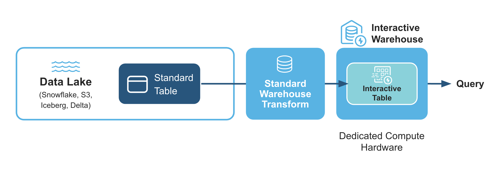
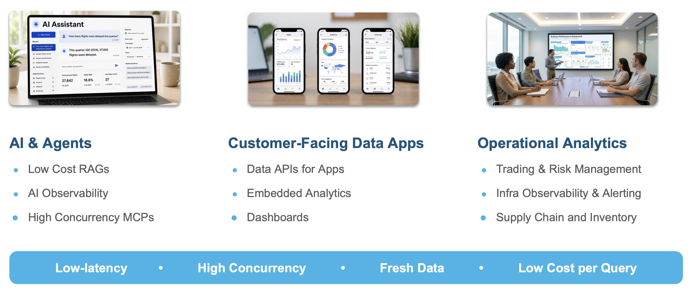
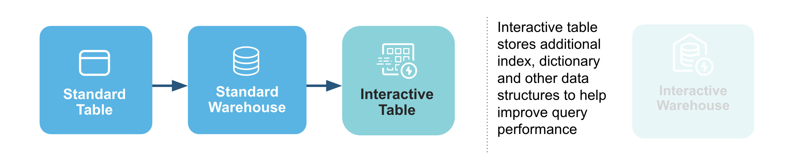
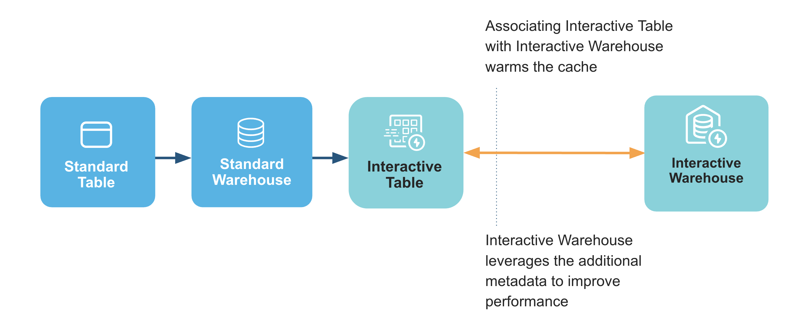
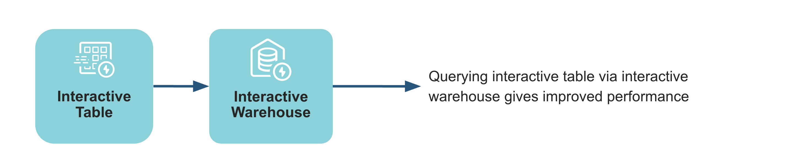
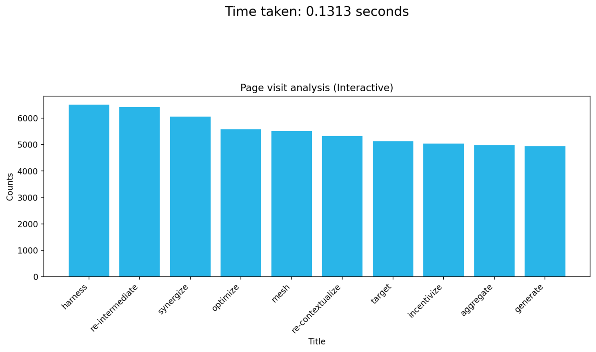

author: Chanin Nantasenamat
id: getting-started-with-interactive-tables
summary: This guide demonstrates how to set up and use Snowflake's Interactive Warehouses and Tables to achieve sub-second query performance. 
categories: snowflake-site:taxonomy/solution-center/certification/quickstart, snowflake-site:taxonomy/product/analytics, snowflake-site:taxonomy/snowflake-feature/interactive-tables, snowflake-site:taxonomy/snowflake-feature/interactive-warehouse
language: en
environments: web
status: Published
language: en

# Getting Started with Snowflake Interactive Tables

## Overview

When it comes to near real-time (or sub-second) analytics, the ideal scenario involves achieving consistent, rapid query performance and managing costs effectively, even with large datasets and high user demand. 

Snowflake's new Interactive Warehouses and Tables are designed to deliver on these needs. They provide high-concurrency, low-latency serving layer for near real-time analytics. This allows consistent, sub-second query performance for live dashboards and APIs with great price-for-performance. With this end-to-end solution, you can avoid operational complexities and tool sprawl.

Here's how interactive warehouses and tables fits in for a typical data analytics pipeline:


### What You'll Learn
- The core concepts behind Snowflake's Interactive Warehouses and Tables and how they provide low-latency analytics.
- How to create and configure an Interactive Warehouse using SQL.
- The process of creating an Interactive Table from an existing standard table.
- How zero-copy interactive analytics (public preview) lets an Interactive Warehouse query standard tables directly, with no conversion required.
- How to attach a table to an Interactive Warehouse to pre-warm the data cache for faster queries.
- A methodology for benchmarking and comparing the query latency of an interactive setup versus a standard warehouse.

### What You'll Build

You will build a complete, functioning interactive data environment in Snowflake, including a dedicated Interactive Warehouse and an Interactive Table populated with data. You will also create a Python-based performance test that executes queries against both your new interactive setup and a standard configuration, culminating in a comparative bar chart that visually proves the latency improvements.

### Prerequisites
- Access to a [Snowflake account](https://signup.snowflake.com/?utm_source=snowflake-devrel&utm_medium=developer-guides&utm_cta=developer-guides)
- Basic knowledge of SQL and Python.
- Familiarity with data warehousing and performance concepts.
- A Snowflake role with privileges to create warehouses and tables (*i.e.*, `ACCOUNTADMIN` is used in the notebook).

## Understand Interactive Warehouses and Interactive Tables

To boost query performance for interactive, sub-second analytics, Snowflake introduces two new, specialized objects that work together: interactive warehouses and interactive tables.

Think of them as a high-performance pair. Interactive tables are structured for extremely fast data retrieval, and interactive warehouses are the specialized engines required to query them. Using them in tandem is the key to achieving the best possible query performance and lowest latency.



### Interactive Warehouses
An interactive warehouse tunes the Snowflake engine specially for low-latency, interactive workloads. This type of warehouse is optimized to run continuously, serving high volumes of concurrent queries. All interactive warehouses run on the latest generation of hardware. Interactive warehouses can query interactive tables and, with zero-copy interactive analytics (in public preview), standard tables directly.

### Interactive Tables
Interactive tables have different methods for data ingestion and support a more limited set of SQL statements and query operators than standard Snowflake tables.

### Zero-copy interactive analytics (Public Preview)

> Note: Querying standard tables through an interactive warehouse is in Public Preview and available to all accounts.

Originally, an interactive warehouse could only query interactive tables, which meant you first had to copy or convert your data into an interactive table. With **zero-copy interactive analytics**, an interactive warehouse can now query your **standard tables (and their views) directly** — with no `CREATE INTERACTIVE TABLE`, no CTAS, and no `TARGET_LAG` refresh pipeline to manage.

This means you can simply point an interactive warehouse at the tables you already have:

```sql
CREATE OR REPLACE INTERACTIVE WAREHOUSE my_dashboard_wh WAREHOUSE_SIZE = 'XSMALL';
USE WAREHOUSE my_dashboard_wh;

-- Query an existing standard table directly, no conversion required
SELECT customer_segment, COUNT(*), SUM(revenue)
FROM analytics.core.orders
WHERE order_date >= CURRENT_DATE() - 30
GROUP BY customer_segment;
```

With this approach, `ALTER WAREHOUSE ... ADD TABLES` is no longer a prerequisite; it becomes a performance *optimization*. Attaching a table proactively warms the warehouse's data cache so queries avoid a cold-start penalty, while any unattached table is still fully queryable and cached on demand the first time it's accessed.

A few things to keep in mind:
- Clustering source tables isn't required, but it's highly recommended for better partition pruning and performance.
- Proactive cache warming with `ADD TABLES` is currently limited to 10 tables. This limits only what is pre-warmed, not what you can query.
- Interactive warehouses cap query run time at 5 seconds. Configure a fallback warehouse so that longer queries transparently re-run on a standard warehouse instead of failing.
- Interactive tables remain the best choice for workloads with the strictest tail-latency (p99) SLAs or specialized clustering needs.

### Use cases
Snowflake interactive tables are optimized for fast, simple queries when you require consistent low-latency responses. Interactive warehouses provide the compute resources required to serve these queries efficiently. Together, they enable use cases such as live dashboards, data-powered APIs, and serving high-concurrency workloads.



Furthermore, this pairing of interactive warehouses and tables is ideal for a range of specific, demanding use cases where sub-second query performance is paramount. In industries like ad-tech, IoT, and video analytics, it can power near real-time decisioning on massive event streams. For application development, it enables highly responsive data-powered APIs and in-app user behavior analytics. It's also perfectly suited for internal analytics, providing the speed needed for live dashboards, BI acceleration, and critical observability/APM systems that require high-throughput alerting.


### Limitations

The queries that work best with interactive tables are usually `SELECT` statements with selective `WHERE` clauses, optionally including a `GROUP BY` clause on a few dimensions.

Here are some limitations of interactive warehouses and interactive tables:
- An interactive warehouse is designed to stay up and running. It supports auto-suspend and auto-resume, but the minimum auto-suspend interval is 24 hours (86400 seconds), so it suspends only after 24 hours of inactivity. You can also suspend and resume it manually. Either way, expect significant query latency right after a resume, while the data cache warms up again.
- Interactive warehouses cancel any query that runs longer than 5 seconds, since they're tuned for short, low-latency queries. To protect p99 latency, configure a fallback warehouse so those queries are transparently re-run on a standard warehouse (see the "Configure a fallback warehouse" section below). Interactive tables also don't support ETL or data manipulation language (DML) commands such as `UPDATE` and `DELETE`.
- To modify data: if you're using an interactive table, update the base (source) table and either fully replace the interactive table with a new version or use a dynamic-table-style incremental refresh (set `TARGET_LAG`). If you're querying a standard table directly, no additional step is needed — changes to the source data are reflected automatically.
- With zero-copy interactive analytics (public preview), an interactive warehouse can query standard tables directly, in addition to interactive tables.
- You can't run `CALL` commands to call stored procedures through interactive warehouse

<!-- ------------------------ -->
## Setup

### Data operations

#### Optional: Create warehouse

In order to create an interactive table and fill the table with data, you'll need to use a standard warehouse.
You can use any existing warehouse or create a new one, here we'll create a new warehouse called `WH`:

```sql
CREATE OR REPLACE WAREHOUSE WH WITH WAREHOUSE_SIZE='X-SMALL';
```

#### Step 1: Create a Database and Schema

First, we'll start by creating a database called `MY_DEMO_DB` and `BENCHMARK_FDN` and `BENCHMARK_INTERACTIVE` as schemas:

```sql
CREATE DATABASE IF NOT EXISTS MY_DEMO_DB;
CREATE SCHEMA IF NOT EXISTS MY_DEMO_DB.BENCHMARK_FDN;
CREATE SCHEMA IF NOT EXISTS MY_DEMO_DB.BENCHMARK_INTERACTIVE;
```

#### Step 2: Create a new stage
Next, we'll create a stage called `my_csv_stage` where the CSV file will soon be stored:

```sql
-- Define database and schema to use
USE SCHEMA MY_DEMO_DB.BENCHMARK_FDN;

-- Create a stage that includes the definition for the CSV file format
CREATE OR REPLACE STAGE my_csv_stage
  FILE_FORMAT = (
    TYPE = 'CSV'
    SKIP_HEADER = 1
    FIELD_OPTIONALLY_ENCLOSED_BY = '"'
  );
```

#### Step 3: Upload CSV to a stage

1. In the Snowflake UI, navigate to the database/schema that you've created (`MY_DEMO_DB.BENCHMARK_FDN`).
2. Go to the `my_csv_stage` stage
3. Upload the [`synthetic_hits_data.csv`](https://github.com/Snowflake-Labs/snowflake-demo-notebooks/blob/main/Interactive_Tables/synthetic_hits_data.csv) file to this stage.

#### Step 4: Create the Table and Load Data

Now that we have the CSV file in the stage, we'll need to create the `HITS2_CSV` table and extract contents from the CSV file into it.

```sql
-- Use your database and schema
USE SCHEMA MY_DEMO_DB.BENCHMARK_FDN;

-- Create the table with the correct data types
CREATE OR REPLACE TABLE HITS2_CSV (
    EventDate DATE,
    CounterID INT,
    ClientIP STRING,
    SearchEngineID INT,
    SearchPhrase STRING,
    ResolutionWidth INT,
    Title STRING,
    IsRefresh INT,
    DontCountHits INT
);

-- Copy the data from your stage into the table
-- Make sure to replace 'my_csv_stage' with your stage name
COPY INTO HITS2_CSV FROM @my_csv_stage/synthetic_hits_data.csv
  FILE_FORMAT = (TYPE = 'CSV' SKIP_HEADER = 1);
```

#### Step 5: Query the data

Finally, we'll now retrieve contents from the table by performing a simple query with the `SELECT` statement:

```sql
USE WAREHOUSE WH;
SELECT * FROM MY_DEMO_DB.BENCHMARK_FDN.HITS2_CSV;
```

This essentially retrieves data from the `MY_DEMO_DB` database, `BENCHMARK_FDN` schema and `HITS2_CSV` table:


<!-- ------------------------ -->
## Performance Demo of Snowflake's Interactive Warehouses/Tables

To proceed with carrying out this performance comparison of interactive warehouses/tables with standard ones, you can download notebook file [Getting_Started_with_Interactive_Tables.ipynb](https://github.com/Snowflake-Labs/snowflake-demo-notebooks/blob/main/Interactive_Tables/Getting_Started_with_Interactive_Tables.ipynb) provided in the repo.

### Load libraries and define custom functions

We'll start by loading the prerequisite libraries and defining helper functions that will be used for the benchmark. Since we'll perform the setup (creating the warehouse, table, and attaching them) using native SQL cells, this Python cell only needs the libraries and functions required to time the queries and plot the results.

```python
import matplotlib.pyplot as plt
import numpy as np
import time

from snowflake.snowpark.context import get_active_session
session = get_active_session()
cursor = session.connection.cursor()

def run_and_measure(count, mode):
    if mode == "std":
        query = """
                SELECT SearchEngineID, ClientIP, COUNT(*) AS c, SUM(IsRefresh), AVG(ResolutionWidth) FROM 
                BENCHMARK_FDN.HITS2_CSV
                WHERE SearchPhrase <> '' GROUP BY SearchEngineID, ClientIP ORDER BY c DESC LIMIT 10;
                """
        cursor.execute("USE WAREHOUSE wh")
    else:
        query = """
                SELECT SearchEngineID, ClientIP, COUNT(*) AS c, SUM(IsRefresh), AVG(ResolutionWidth) FROM 
                BENCHMARK_INTERACTIVE.CUSTOMERS
                WHERE SearchPhrase <> '' GROUP BY SearchEngineID, ClientIP ORDER BY c DESC LIMIT 10;
                """
        cursor.execute("USE WAREHOUSE interactive_demo_b")
    
    timings = []
    cursor.execute('ALTER SESSION SET USE_CACHED_RESULT = FALSE;')
    for i in range(count + 1):
        t0 = time.time()
        cursor.execute(query).fetchall()
        time_taken = time.time() - t0
        timings.append(time_taken)
                
    return timings[1:]
    
def plot_data(data, title, time_taken, color='#29B5E8'):
    # Separate titles and counts
    titles = [item[0] for item in data]
    counts = [item[1] for item in data]

    # Plot bar chart
    
    plt.figure(figsize=(12, 4))
    plt.bar(titles, counts, color=color)
    plt.xticks(rotation=45, ha='right')
    plt.ylabel("Counts")
    plt.xlabel("Title")
    plt.title(title)
    plt.text(0.5, 1.5, f'Time taken: {time_taken:.4f} seconds',
         ha='center', va='top',
         transform=plt.gca().transAxes,
         fontdict={'size': 16})
    #plt.tight_layout()
    plt.show()

```

### Set the active role and database

Interactive Warehouses and Interactive Tables are now generally available (GA) and enabled by default on your account, so there's no need to check the Snowflake version or verify any account parameters.

Using a SQL cell, we'll simply set the active role and database for the session:

```sql
USE ROLE ACCOUNTADMIN;
USE DATABASE MY_DEMO_DB;
```

> Note: In a Snowflake Notebook, SQL and Python cells share the same session. Any `USE ROLE`, `USE DATABASE`, or `USE WAREHOUSE` statement you run in a SQL cell also applies to subsequent Python cells (and vice versa).

### Create an interactive warehouse


Next, let's create our `interactive_demo_b` warehouse and immediately turn it on using a SQL cell:

```sql
CREATE OR REPLACE INTERACTIVE WAREHOUSE interactive_demo_b
    WAREHOUSE_SIZE = 'XSMALL'
    MIN_CLUSTER_COUNT = 1
    MAX_CLUSTER_COUNT = 1
    COMMENT = 'Interactive warehouse demo';
```

This should yield the following output:

```
--------------------------------------------------------------  
INTERACTIVE WAREHOUSE INTERACTIVE_DEMO_B successfully created.  
--------------------------------------------------------------  
```

### Create an interactive table



> Note: With zero-copy interactive analytics (public preview), creating an interactive table is now optional — an interactive warehouse can query the standard `HITS2_CSV` table directly. We still create an interactive table here to demonstrate that path and to enable a head-to-head performance comparison later in this guide.

Now, we'll use the standard `WH` warehouse to efficiently create our new interactive `CUSTOMERS` table by copying all the data from the original standard table:

```sql
-- Use a standard warehouse to build the interactive table's data
USE ROLE ACCOUNTADMIN;
USE WAREHOUSE WH;
CREATE SCHEMA IF NOT EXISTS MY_DEMO_DB.BENCHMARK_INTERACTIVE;

CREATE OR REPLACE INTERACTIVE TABLE
  MY_DEMO_DB.BENCHMARK_INTERACTIVE.CUSTOMERS CLUSTER BY (ClientIP)
AS
  SELECT * FROM MY_DEMO_DB.BENCHMARK_FDN.HITS2_CSV;
```

This gives the following output:
```
-------------------------------------  
Table CUSTOMERS successfully created. 
-------------------------------------
```

### Attach interactive table to a warehouse



Next, we'll attach our interactive table to the warehouse, which pre-warms the data cache for optimal query performance:

```sql
USE DATABASE MY_DEMO_DB;
ALTER WAREHOUSE interactive_demo_b ADD TABLES(BENCHMARK_INTERACTIVE.CUSTOMERS);
```

> Note: `ADD TABLES` is a performance optimization, not a requirement. It proactively warms the warehouse's data cache so queries avoid a cold start. Any table you don't attach is still queryable and gets cached on demand the first time it's accessed. Proactive warming is currently limited to 10 tables.

Running the above statement should yield the following:
```
-------------------------------- 
Statement executed successfully.  
--------------------------------  
...
```

### Configure a fallback warehouse

Interactive warehouses are tuned for short, sub-second queries, so Snowflake fixes their statement timeout at a maximum of 5 seconds and automatically cancels any query that runs longer. To make sure an occasional heavy or ad-hoc query still completes instead of failing, you can designate a **fallback warehouse**: a standard warehouse that automatically re-runs any query that exceeds the 5-second timeout on the interactive warehouse.

This retry is transparent to the client (it behaves as an internal retry), so the query still returns its result. It keeps fast dashboard queries responsive while isolating them from the occasional long-running query.

We'll reuse the standard `WH` warehouse created earlier as the fallback for our interactive warehouse:

```sql
ALTER WAREHOUSE interactive_demo_b SET FALLBACK_WAREHOUSE = WH;
```

You can confirm the setting by inspecting the `FALLBACK_WAREHOUSE` column:

```sql
SHOW WAREHOUSES LIKE 'interactive_demo_b';
```

A few things to keep in mind about fallback warehouses:
- The fallback is a **standard** warehouse and can be shared with non-interactive workloads. Choose a size that's the same as or larger than the interactive warehouse.
- It must be started (or set to auto-resume) to accept retried queries, and standard credit consumption applies once it's active.
- The querying role needs `USAGE` on both the interactive warehouse and its fallback warehouse. Setting a fallback requires `ALTER WAREHOUSE` on the interactive warehouse and `USAGE` on the fallback.
- When a retry occurs, the time spent on the interactive warehouse before the retry appears as `fault_handling_time` in the query profile.
- To remove the fallback warehouse later, run `ALTER WAREHOUSE interactive_demo_b UNSET FALLBACK_WAREHOUSE;`.

### Run queries with interactive warehouse



Now, we'll run our first performance test on the interactive setup by executing a page-view query, timing its execution, and then plotting the results.

We'll start by activating the interactive warehouse and disabling the result cache using a SQL cell:

```sql
USE WAREHOUSE interactive_demo_b;
USE DATABASE MY_DEMO_DB;
ALTER SESSION SET USE_CACHED_RESULT = FALSE;
```


Next, in a Python cell we'll run a query to find the top 10 most viewed pages for July 2013, measure how long it takes, and then plot the results and execution time:

```python
query = """
SELECT Title, COUNT(*) AS PageViews
FROM BENCHMARK_INTERACTIVE.CUSTOMERS
WHERE CounterID = 62
  AND EventDate >= '2013-07-01'
  AND EventDate <= '2013-07-31'
  AND DontCountHits = 0
  AND IsRefresh = 0
  AND Title <> ''
  AND REGEXP_LIKE(Title, '^[\\x00-\\x7F]+$')
  AND LENGTH(Title) < 20
GROUP BY Title
ORDER BY PageViews DESC
LIMIT 10;
"""

start_time = time.time()
result = cursor.execute(query).fetchall()
end_time = time.time()
time_taken = end_time - start_time

plot_data(result, "Page visit analysis (Interactive)", time_taken)
```

This gives the following plot:



### Compare to a standard warehouse


To establish a performance baseline, we'll run an identical page-view query on a standard warehouse to measure and plot its results for comparison.

We'll start by preparing the session for a performance benchmark by selecting a standard `WH` warehouse, disabling the result cache, and setting the active database using a SQL cell:

```sql
USE WAREHOUSE WH;
USE DATABASE MY_DEMO_DB;
ALTER SESSION SET USE_CACHED_RESULT = FALSE;
```


Here, in a Python cell we'll run a top 10 page views analysis by executing the query, measuring its performance, and immediately plotting the results and execution time:

```python
query = """
SELECT Title, COUNT(*) AS PageViews
FROM BENCHMARK_FDN.HITS2_CSV
WHERE CounterID = 62
  AND EventDate >= '2013-07-01'
  AND EventDate <= '2013-07-31'
  AND DontCountHits = 0
  AND IsRefresh = 0
  AND Title <> ''
  AND REGEXP_LIKE(Title, '^[\\x00-\\x7F]+$')
  AND LENGTH(Title) < 20
GROUP BY Title
ORDER BY PageViews DESC
LIMIT 10;
"""

start_time = time.time()
result = cursor.execute(query).fetchall()
end_time = time.time()
time_taken = end_time - start_time

plot_data(result, "Page visit analysis (Standard)", time_taken, '#5B5B5B')
```


### Run some queries concurrently

To directly compare performance, we'll benchmark both the interactive and standard warehouses over several runs and then plot their latencies side-by-side in a grouped bar chart:

```python
runs = 5

counts_iw = run_and_measure(runs,"iw")
print(counts_iw)

counts_std = run_and_measure(runs,"std")
print(counts_std)

titles = [f"R{i}" for i in range(1, len(counts_iw)+1)]

x = np.arange(len(titles))  # the label locations
width = 0.35  # bar width

fig, ax = plt.subplots(figsize=(8, 5))
ax.bar(x - width/2, counts_std, width, label="Standard", color="#5B5B5B")
ax.bar(x + width/2, counts_iw, width, label="Interactive", color="#29B5E8")

ax.set_ylabel("Latency")
ax.set_xlabel("Query run")
ax.set_title("Standard vs Interactive warehouse")
ax.set_xticks(x)
ax.set_xticklabels(titles)
ax.legend(
    loc='upper center',
    bbox_to_anchor=(0.5, -0.15),
    ncol=2
)
plt.show()
```


## Conclusion And Resources

In this guide, we explored how to address the challenge of low-latency, near real-time analytics using Snowflake's interactive warehouses and tables. We walked through the complete setup process, from creating the necessary database objects and loading data to configuring and attaching an interactive table to an interactive warehouse. The subsequent performance benchmark clearly demonstrated the substantial latency improvements these specialized features provide over standard configurations, especially under concurrent query loads. This confirms their value as a powerful solution for demanding use cases like live dashboards and high-throughput data APIs, where sub-second performance is critical.

### What You Learned
- Interactive warehouses and tables work together as a specialized pair to deliver low-latency analytics for use cases like live dashboards and APIs.
- How to create, configure, and attach interactive warehouses and tables using SQL to prepare a high-performance analytics environment.
- How to benchmark and visually demonstrate the performance gains of interactive setups over standard ones using Python, proving their effectiveness for high-concurrency workloads.

### Related Resources

Data and Notebook:
- [synthetic_hits_data.csv](https://github.com/Snowflake-Labs/snowflake-demo-notebooks/blob/main/Interactive_Tables/synthetic_hits_data.csv)
- [Getting_Started_with_Interactive_Tables.ipynb](https://github.com/Snowflake-Labs/snowflake-demo-notebooks/blob/main/Interactive_Tables/Getting_Started_with_Interactive_Tables.ipynb)

Documentation:
- [Snowflake interactive tables and interactive warehouses](https://docs.snowflake.com/en/user-guide/interactive)
